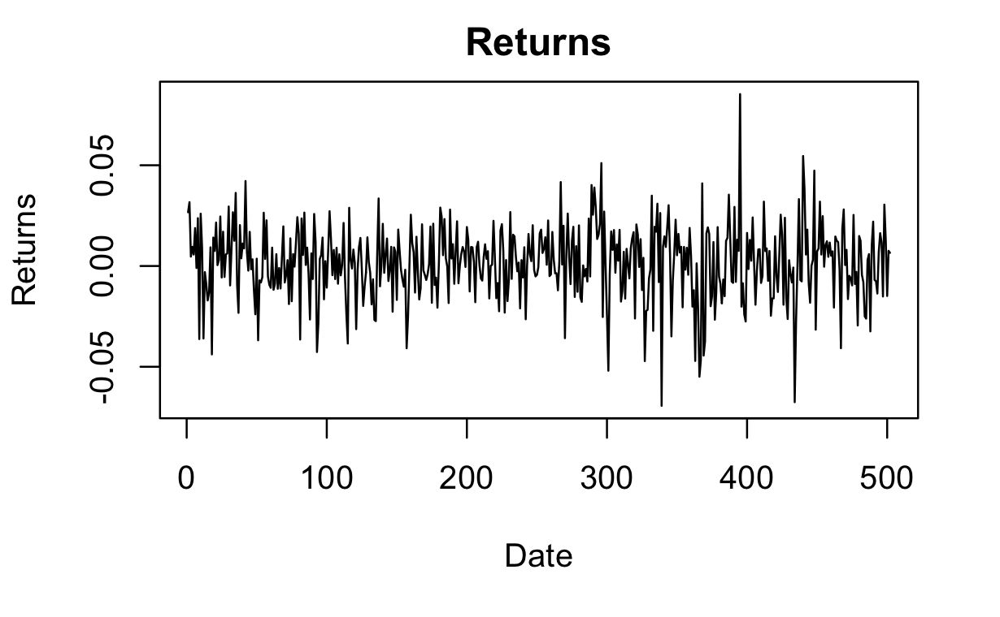

```{r setup, include=FALSE}
knitr::opts_chunk$set(echo = FALSE)
```

```{css, echo=FALSE}
#title {
  padding-top: 1.5cm;
  padding-bottom: 1.5cm;
}

.title_container {
  height: calc(38in * 0.13);
}

img {
  margin-top: 0cm;
}
```

# 1. Abstract
Using natural language processing techniques and modified time-series modeling, this paper aims to establish a methodology to test whether twitter sentiment is informative in predicting stock price movement and its volatility for the Chevron Corporation(CVX). The following QR Code links to the file repository.

<div style="text-align: center;">
  
</div>
<!-- <image width="50%" src="figures/qr.png" class="center"/> -->

# 2. Introduction
This paper aims to determine if there is a correlation between public sentiment on Twitter and Chevron's stock price. It will use a machine learning technique called sentiment analysis with a BERT Transformer model to analyze Twitter data from January 1st, 2021-December 31st, 2022 and compare it with Chevron's stock prices in the same years. The paper includes sections on data collection, statistical methods, results, and further discussion.

# 3. Methods

## 3.1. Data Collection
<!-- Twitter data related to the Chevron Corporation was collected using web scraping techniques. Specifically, tweets containing the term ”CVX” were extracted from Twitter using the topic selection method provided by the snscrape Python wrapper @snscrape. The tweets were collected for a period of 2 years, from January 1, 2021 to December 31, 2022 with 10 tweets being collected each day. Financial stock data was also collected for the Chevron corporation within this same period. For the purposes of this paper, returns obtained by taking the log difference of the daily closing prices.  -->
- Twitter data collected for Chevron Corporation using web scraping and the snscrape Python wrapper[@justanotherarchivist_2022].
- Tweets containing "CVX" extracted from Twitter for 2-year period: January 1, 2021 to December 31, 2022, 10 tweets collected per day.
- Financial stock data also collected for Chevron for same period.
- Returns calculated by taking log difference of daily closing prices for analysis.

<div style="text-align: center;">
  
</div>

## 3.2. Sentiment Analysis
<!-- The sentiment analysis involved utilizing Hugging Face's BERT transformer architecture to assign sentiment scores to each tweet. Using self-attention mechanisms such as encoders and decoders to process input sequences in parallel, transformers can capture long-range dependencies and relationships between words, making it highly effective for tasks such as language translation and natural language processing, and for our purpose, sentiment analysis. -->
- Hugging Face's BERT transformer architecture used.[@huggingface2023]
- Self-attention mechanisms (encoders and decoders) were used to process input sequences in parallel.
- Transformers use attention are very effective for capturing long-range dependencies and relationships between words.Conceptualized in [@vaswani2017attention]
- BERT used for sentiment analysis in this study.[@devlin2018bert]

<div style="text-align: center;">
  
</div>

## 3.3. ARMA-GARCH
ARMA-GARCH is a time-series modeling approach that combines Autoregressive Moving Average (ARMA) models for capturing time-dependent patterns with Generalized Autoregressive Conditional Heteroskedasticity (GARCH) models for modeling time-varying volatility.

# 4. Results
<!-- Within the specified period of January 1st, 2021-December 31st, 2022, we collected 10 tweets a day. We then selected data for the 502 dates that the stock market was open and averaged the sentiment scores for each day. The following histogram shows the normal distribution observed in the data. -->

<!-- <image width="100%" src="poster_files/figures/sentimenthist.png"/> -->

<!-- After obtaining the sentiment score as daily sentiment we created an ARMA-GARCH model first only using the daily sentiment and then comparing to an ARMA-GARCH model with daily sentiment as an exogenous variable. The ARMA part of this technique, models the autocorrelation and moving average patterns in the data and GARCH models the volatility or conditional heteroskedasticity of the data. To determine whether daily sentiment, the exogenous variable has any effect on the model, we conducted the Likelihood ratio test. The p-value associated with the likelihood ratio test that we used was above which was our chosen significance value of 0.05, so we could not reject that the null hypothesis that the exogenous variable has no effect on the model. We tried this same technique by applying a weight to the sentiment score and obtained similar results. -->
- Data selected for 502 dates when stock market was open.
- 10 Sentiment scores calculated and averaged for each day.

Histogram showing normal distribution observed in the data.

<div style="text-align: center;">
  
</div>

- Conducted Likelihood ratio test to determine effect of daily sentiment as exogenous variable.
- Chosen significance value: 0.05.
- Likelihood ratio test gave a p-value above 0.05, indicating no significant effect of exogenous variable on the model.
- A weighted sentiment was also tried and similar results were concluded.

# 5. Conclusion

## 5.1. Possible Expansions
- Increase sample size for more robust analysis.
- Test for causality using techniques like the Granger causality test.
- Conduct meta-analysis of multiple companies in the fossil fuel industry for broader insights.

## 5.2. Takeaway
While both weighted and unweighted sentiment score might not have been effective in predicting stock price movement and volatility of CVX, this paper establishes a novel methodology that can be applied to determine whether twitter sentiment is informative in predicting stock movement and volatility across many industries and sectors.

# 6. References
